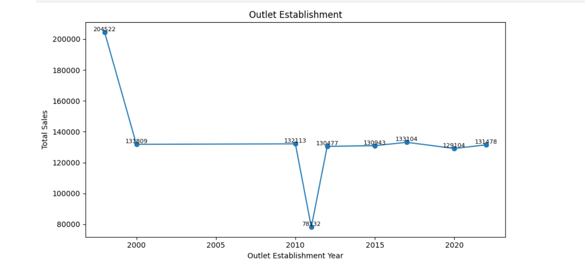
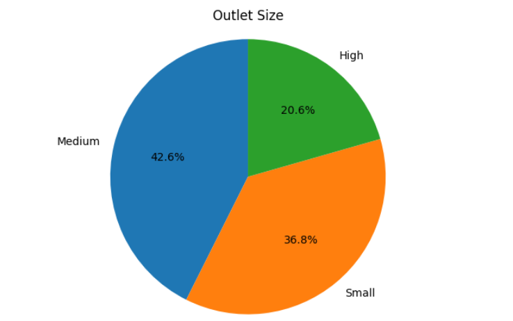
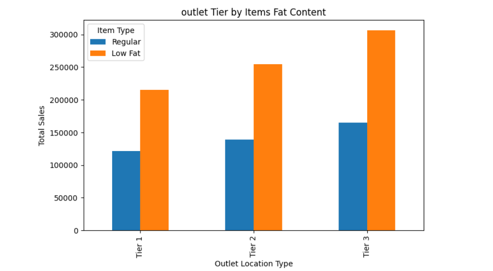
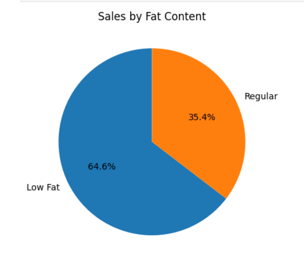
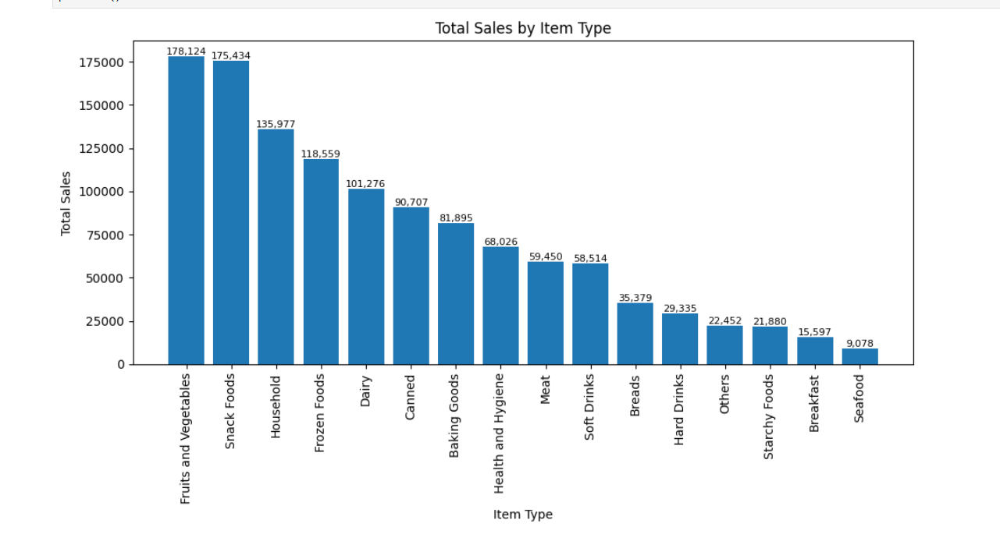
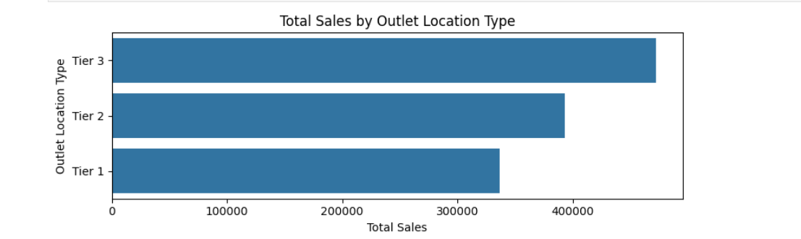

# FUTURE_DS_01 — Business Sales Performance Analytics

## Internship Details
This project was completed as part of the Data Science & Analytics Internship offered by Future Interns.

## Project Type
Business Sales Performance Analytics

## Project Objective
The goal of this project is to analyze Blinkit sales data to identify:
- Revenue trends
- Top-performing product categories
- Sales performance across outlet types
- Customer purchasing patterns
- Business insights and recommendations

## Tools & Technologies Used
- Python
- Pandas
- NumPy
- Matplotlib
- Seaborn
- Jupyter Notebook

## Dataset Used
Blinkit Grocery Sales Dataset

## Key Performance Indicators (KPIs)
- Total Sales
- Average Sales
- Number of Items Sold
- Average Product Rating
- Category-wise Sales
- Outlet-wise Performance

---

# Dashboard Preview

## Outlet Establishment Trend

## Outlet Size Distribution

## Outlet Tier by Fat Content

## Sales by Fat Content

## Total Sales by Item Type

## Total Sales by Outlet Location

---

# Business Insights

### 1. Tier 3 outlets generated the highest total sales.
This indicates that Tier 3 locations had stronger customer demand and overall better sales performance compared to Tier 1 and Tier 2 outlets.

### 2. Medium-sized outlets contributed the largest share of sales.
Outlet size appears to directly influence product variety and customer purchasing activity.

### 3. Low-fat products generated higher overall sales than regular products.
This suggests growing customer preference toward healthier product options.

### 4. Fruits & Vegetables and Snack Foods were the highest-performing product categories.
These categories contributed the most revenue and showed consistently high demand.

### 5. Seafood and Breakfast categories recorded the lowest sales.
These categories may require improved marketing strategies or inventory optimization.

### 6. Sales remained relatively stable across most outlet establishment years.
However, older outlets established around 1998 generated significantly higher sales compared to newer outlets.

---

# Business Recommendations

- Increase inventory and promotional efforts for high-performing categories such as Fruits & Vegetables and Snack Foods.
- Expand operations in Tier 3 locations due to their strong revenue contribution.
- Focus on medium-sized outlets, as they demonstrate the best overall sales performance.
- Improve visibility and promotional strategies for low-performing categories like Seafood and Breakfast items.
- Introduce targeted marketing campaigns for regular-fat products to improve category balance.
- Analyze successful older outlets to identify strategies that can be replicated in newer stores.

---

# Repository Contents

- `BlinkIT Grocery Data.ipynb` → Data analysis notebook
- `requirements.txt` → Required Python libraries
- `screenshots/` → Dashboard and chart visualizations
- `README.md` → Project documentation

---

# Conclusion

This analysis helped identify key sales patterns, customer preferences, and business opportunities using Blinkit sales data. The project demonstrates how data analytics can support business decision-making and improve operational performance.

---

# Author

Risika Singh

Data Science & Analytics Intern — Future Interns
